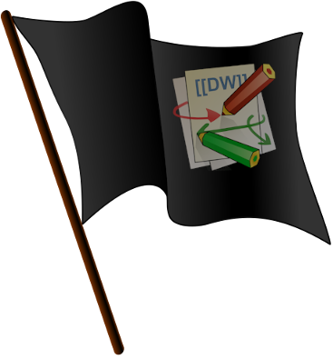

DokuWiki Docker Image (based on RiotKit's PHP-APP container)
============================================================

[](https://travis-ci.org/riotkit-org/docker-dokuwiki)



## What is DokuWiki?

```
DokuWiki is a simple to use and highly versatile Open Source wiki software that doesn't require a database. 
It is loved by users for its clean and readable syntax. 
The ease of maintenance, backup and integration makes it an administrator's favorite. 
Built in access controls and authentication connectors make DokuWiki especially useful in the enterprise context 
and the large number of plugins contributed by its vibrant community allow for a broad range of 
use cases beyond a traditional wiki.
```

## Requirements to build image

- Docker
- JINJA2 CLI (j2cli - `pip install j2cli`)

## Image

The image is built with superpower of RiotKit's PHP image. See
[php-app](https://github.com/riotkit-org/docker-php-app) for available
envronment variables to configure.

## Extending

Please put your files and JINJA2 templates into the container with
bind-mount under /.etc.template - all files there will be copied into
/etc with additional JINJA2 rendering (only .j2 files)

The base image [php-app](https://github.com/riotkit-org/docker-php-app)
is supporting files in /.etc.template/nginx/conf.d/ to extend NGINX
configuration.

See also variables in
[php-app](https://github.com/riotkit-org/docker-php-app), they are very
useful, and there are a lot of options.

```
# building a stable version manually, without pushing to registry
make build VERSION=stable PUSH=false

# running
sudo docker run --name wiki --rm -p 80:80 quay.io/riotkit/dokuwiki:stable
```

## How does the image building work?

Dockerfile is generated from a template `Dockerfile.j2`, it's a JINJA2
template (mostly used standard by DevOps around the world). 

The variables required for rendering of the `Dockerfile.j2` are in
`versions` directory. 

`Makefile` is listing all versions, and going through them. For each
version it is rendering a `Dockerfile.j2` into a `Dockerfile` and
executing a `docker build`, next `docker tag` and `docker push`.

**What about configuration files, huh?**

Files in `etc` directory are copied into `.etc.template`, and then the
entrypoint is rendering all jinja2 templates into `etc`, and the rest
files are just copied as is.
